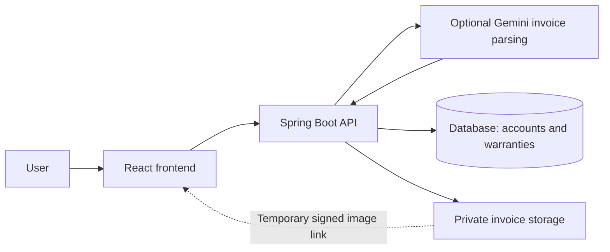

# Warranty Tracker

Track product warranties and keep their invoices in one place. This document
is the high-level workflow and project map; setup details live in the linked guides.

## User workflow

1. **Sign up or log in.** The backend authenticates the user. Each account sees
   only its own warranties.
2. **Add a warranty.** Enter product, purchase, and coverage details, and
   optionally choose an invoice image.
3. **Optionally parse the invoice.** The backend sends its image to Google Gemini.
   Review the returned form suggestions and apply selected details. Nothing is
   saved yet; missing or ambiguous fields remain manual.
4. **Save.** The backend validates the form, saves the warranty in the database,
   and stores the invoice privately when Supabase storage is configured.
5. **Manage coverage.** Use the dashboard or inventory to find, edit, or delete
   warranties. Open an invoice through a temporary signed link; refresh it if
   it expires. Deleting a warranty also queues its invoice for cleanup.

The browser handles the interface and extraction review. Spring Boot handles authentication,
validation, account isolation, and storage access. Supabase provides PostgreSQL
and private invoice storage in the intended hosted setup. Authentication is
implemented by this application's backend, not Supabase Auth.
Optional invoice parsing uses a server-only `GEMINI_API_KEY`; see the backend guide.

## What is where

| Location | Responsibility |
| --- | --- |
| [Frontend/](Frontend/) | React screens, forms, dashboard, inventory, and invoice viewing. |
| `Frontend/src/pages/` | Main screens, including add/edit warranty and account connections. |
| `Frontend/src/components/` | Reusable controls, delete confirmation, invoice viewer, and OCR review dialog. |
| `Frontend/src/services/`, `context/`, `utils/` | API calls, session state, validation, and OCR processing. |
| [Backend/](Backend/) | Spring Boot API, authentication, warranty operations, private invoice access, and cleanup. |
| `Backend/src/main/java/com/warrantytracker/` | Controllers, services, security, and database access. |
| `Backend/src/main/resources/` | Runtime configuration and versioned database migrations under `db/`. |
| [Database/](Database/) | Database reference material and hosted Supabase setup instructions. Runtime migrations live in the backend. |
| `Frontend/tests/`, `Backend/src/test/` | Unit, browser, API, storage, and release-flow tests. |
| [Dockerfile](Dockerfile), [compose.yaml](compose.yaml) | Package the frontend and API together and configure the deployment service. |
| [.github/workflows/](.github/workflows/) | Automated release checks and container build configuration. |

## Development and release workflow

For local development, run the frontend and backend separately using their
READMEs. The frontend calls the backend API. With no API URL configured, the
frontend runs a browser-storage demo; it does not provide real account isolation
or save invoice images. The backend's local H2 profile supports authentication
and warranty CRUD, but private invoice storage requires Supabase configuration.

For release, build the frontend into the Spring Boot application. The Docker
configuration packages both as one service, with `/api` on the same origin.
Configure Supabase and secrets, deploy behind HTTPS, then verify signup, add,
edit, receipt viewing, deletion, and isolation between accounts.

The release tests use an isolated PostgreSQL database and a local Storage
fixture. They do not establish that hosted Supabase or a live deployment works.

## Current state

- **Implemented:** email/password authentication, user-scoped warranty CRUD,
  private storage integration, invoice viewing, deletion, session/error handling,
  and Gemini invoice parsing with explicit review (requires an API key).
- **Prepared, awaiting hosted verification:** Supabase setup, deployment
  configuration, and release checks. Docker verification and live deployment
  remain pending.
- **Still planned:** Google sign-in, Gmail invoice import/disconnect, and
  scheduled reminders. Existing Google/Gmail UI is not a completed integration.

## Where to go next

| Document | Use it for |
| --- | --- |
| [TODO.md](TODO.md) | Completed and remaining milestones. |
| [HANDOFF.md](HANDOFF.md) | Latest implementation details, verification results, and where to resume. |
| [Frontend/README.md](Frontend/README.md) | Frontend setup, tests, and OCR behavior. |
| [Backend/README.md](Backend/README.md) | Backend setup, configuration, and API behavior. |
| [Database/SUPABASE_SETUP.md](Database/SUPABASE_SETUP.md) | Creating and connecting the hosted database and private storage. |
| [DEPLOYMENT.md](DEPLOYMENT.md) | Deployment, hosted acceptance checks, and rollback. |
